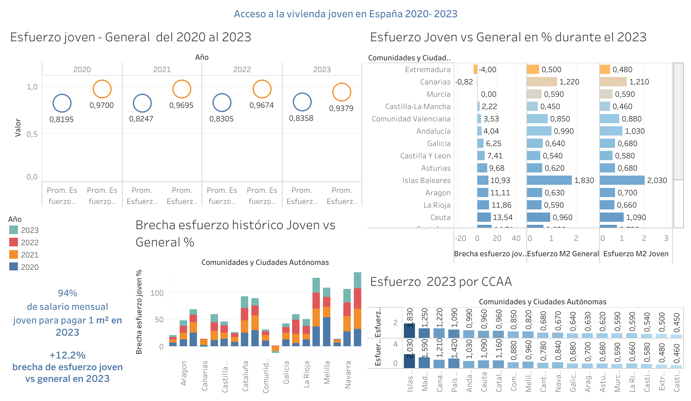
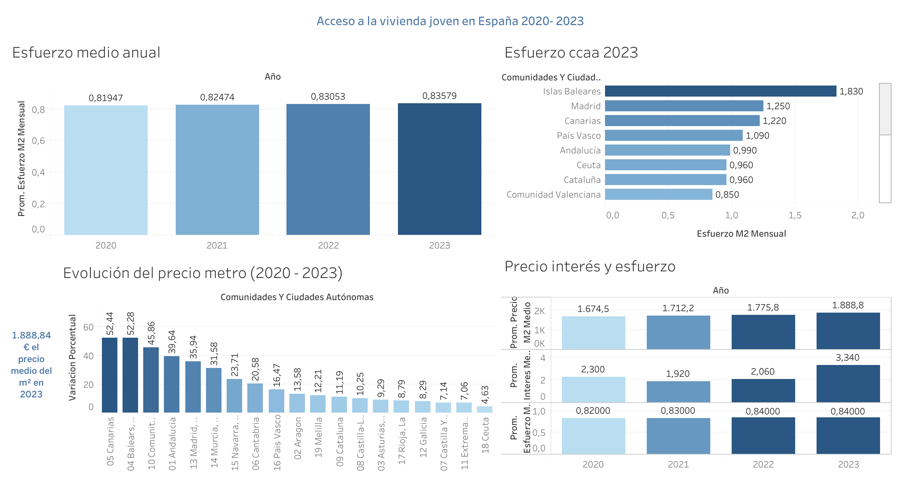

# Youth Housing Spain: Can a Young Person Afford to Buy a Home?
# - Analysis of access to housing for young people in Spain 2020-2023

This project analyzes the real purchasing power of young people in Spain when it comes to buying a home. It compares their situation to the general population, explores regional differences across autonomous communities, and examines the evolution of housing affordability between 2020 and 2023.

---

## Objectives

- Evaluate the financial effort required for young people to buy a home in Spain.
- Analyze the evolution of housing accessibility over time.
- Compare housing access across autonomous communities.
- Explore the generational gap in purchasing power.

---

## Data Sources

- INE: Average salaries by age group and region  
- Idealista: Average price per square meter  
- Bank of Spain: Fixed mortgage interest rates  
- INE: Average housing surface area per region

---

## Tools Used

- **Python** (pandas, matplotlib, seaborn) for data cleaning and analysis  
- **SQL** for data querying and validation  
- **Tableau** for building the final dashboard and visual storytelling  
- **Canva** for final presentation design

---

## Analysis Structure

1. **National evolution of housing effort** (2020–2023)  
2. **Regional comparison of financial effort (CCAA)**  
3. **Variation in price per m² by region**  
4. **Salary growth by age group**  
5. **Correlation between price, salary, interest rates and effort**  
6. **Ranking of housing accessibility by region (2023)**  
7. **Comparison between young vs. general population effort**

---

## Key Insights

- The average monthly financial effort increased by **2%** from 2020 to 2023.
- Regions like **Balearic Islands, Madrid, and the Canary Islands** show the highest difficulty in accessing housing.
- Prices per square meter rose over **50%** in some regions, far outpacing wage growth.
- **Young people consistently face higher financial effort** than the general population across all regions.
- Interest rate variations do **not offset** the rising cost of housing, making access increasingly difficult.

---

## Limitations and Future Improvements

- The analysis does not simulate full mortgage calculations (e.g., monthly installments, down payments, amortization). These could be included in a future extension.
- A **mortgage effort calculator for young people** could be developed as an interactive tool.
- This project focuses on **home buying only**, not renting — a comparative rental study could add further value.

---

## 📊 Visualizaciones del Dashboard

### 1. Evolución del esfuerzo joven vs general y brecha por CCAA

---

### 2. Precio, interés y esfuerzo por CCAA

---

## About Me

I'm Lucía, a data analyst passionate about social impact and storytelling through data.

🔗 **Check out my GitHub profile** to explore other projects: [github.com/luciaruizfraile](https://github.com/luciaruizfraile)
